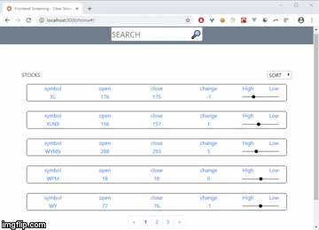

# reactStockApp
A react application ui that shows stocks status

steps:

clone repo: `git clone https://github.com/jolaya182/cadreW.git`

install : `npm i`

run server : `npm run server`

then open another terminal and

run developer mode: `npm start`

go to your browser with localhost url: `http://localhost:3000/#/`
